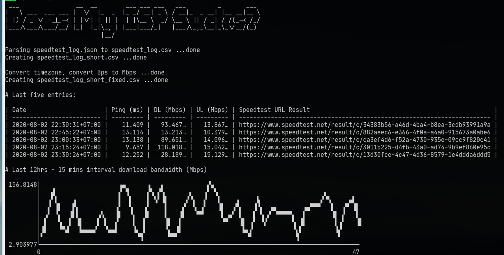

# Does my ISP sucks?

My ISP sucks. Sometimes it sucks less longer, at random given time. How about yours?

- `doesit.sh` - Execute Speedtest.net CLI, saving result in `speedtest_log.json` . Crontab it.
- `create_csv.sh` - Convert the `speedtest_log.json` to good looking CSVs. Graph it, mail it to your ISP, publish it, etc as you like.

# Requirement

- Official Speedtest.net CLI https://www.speedtest.net/apps/cli

Others:

- JQ https://stedolan.github.io/jq - To parse JSON.
- Pandas https://pandas.pydata.org - If want to transform the timezone (from GMT+0 to your local time), bandwidth (from Bps to Mbps)
- JP https://github.com/sgreben/jp - If you want to plot on screen chart
- CSVKit https://csvkit.readthedocs.io/en/latest - Use 'csvlook' for a nice view of CSV
- `header` a script by https://twitter.com/jeroenhjanssens - To easily put header in CSV
- Figlet http://www.figlet.org/ - Banner

> `ialexs`

---

# Updates:

- 02 Aug 2020 . Use CSVKit
- 01 Aug 2020. Add on screen chart using `jp`
- 28 Jul 2020. Add `create_csv.sh` with Python/Pandas to convert timestamp (from GMT+0 to Asia/Jakarta), upload/download (from Bps to Mbps)
- 27 Jul 2020.  Add `create_csv.sh`. For easy reporting in csv/spreadsheet format.

